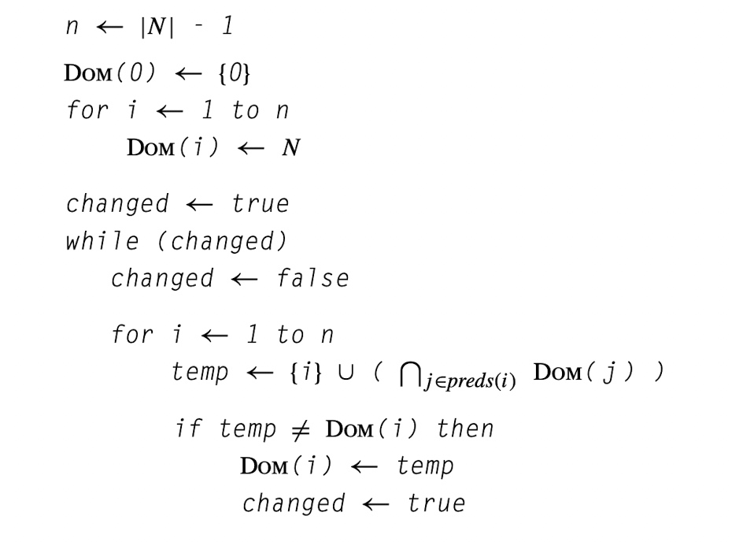

# yfs的毕升杯日报

## 4.28之前

其实我早在2月上旬就开始着手做这个项目了，不过因为有赶上学校开学要准备期末考试，所以中间有接近两周的时间进度有所放缓，直到2月末尾，这个编译器项目大概实现了语义分析阶段，代码量当时达到3000多行。

后来因为一些其他事情，这个项目差点废弃，中间大概40多天的时间没有碰，后来四月中旬开始继续做，调整了一些语义分析的问题之后，开始仿照LLVM以及之前参赛作品去设计IR的结构以及生成部分。后来联系了老师，老师要求每日汇报进度，因此我也有了整理这个周报的想法。

## 4.28

1. 对于数组初始化时相关的IR生成,将连续区间内的置零操作采用memset(如%2 = call i32* @memset(i32* %1, i32 0, i32 8)),并在IR中增加对于memset函数的declare(declare i32* @memset(i32* %0, i32 %1, i32 %2)).
2. 一部分IR指令的输出不够规范,不符合LLVM工具链的标准.调整了关于getelement、数组类型等方面的输出.
3. 之前对于语言中的指针类型认识不够全面.比如说对于内存操作的IR指令,如Alloca,Store,Load,只是考虑简单的值和数组的情况,虽然我一直知道Alloca返回的变量具有指针的性质,但是忽略了像“%v19 = alloca i32*”这种分配了一个“指向指针的指针”的变量,这种情况往往发生在有一个`int []或者int[][32][32]`的参数在函数起始进行初始化的时候,之前只是单纯地认为要么是alloca i32、alloca float,alloca [2 x i32]或者alloca [2 x [3 x i32]]这种情况.同样地对于Store操作,其第二个参数可能会出现像“二级指针”的情况,比如说`store i32* %A16, i32** %v19`,这种情况和前面提到的alloca的情况往往相呼应.基于这些问题,对于相关的IR生成实现进行调整.
4. 由于上面的这个问题,对于CallFunction相关的IR,在处理参数传递时,之前忽略了一些情况,这也是正在改的一个地方,希望今晚能改好吧......

**待做的地方**

+ return处理的问题,尤其是在while或者if的body中的return.
+ 全局变量初始化列表的IR输出不够规范(内存模型没问题,但是想要print的格式不规范).

## 4.29

1. 关于return的第一个bug,之前会出现像这种问题:

```
basic_block:
	ret i32 0
	br %lebal1
```

一个basicblock中一旦出现了一个ret类型的IR指令,后面的指令应该作废.具体采用的实现方式就是增加一个`curr_bb_has_ret_`变量,一旦生成一个ret类型的IR指令,就会被设置为true,因此该基本块后面的所有addInstruction都会无效.

2. 修复了一个关于return的小bug,如果一个函数中没有出现return语句,那么编译器需要为其在末尾添加一个return,具体的做法是,在语义分析阶段,总是会在一个函数体末端插入一个表示return的AST节点.配合上面第一条中提到的方法,也不用担心有重复ret指令的问题.
3. 发现了一个像LvalExpression(左值表达式)节点进行IR生成时,其中对于像`array[1][2]`这种都需要生成相应的getelementptr变量,但是又有不同的情况,比如说下面的例子:

```
int func1(int b) {
    return b + 1;
}

int func(int a[][2][3][10]) {
    int array[1][2][3][4][3][2] = {};
    int b = func1(array[0][1][1][1][1][1]);
    return func(a[0][0]);
}

```

上面关于多维数组的左值表达式,有两种不一样的情况,一种像`array[0][1][1][1][1][1]`这种,表示的一种具体的值,另一种则是一个指向数组的指针,这两种生成的getelementptr指令有所区别第一种是:

```
getelementptr [1 x [2 x [3 x [4 x [3 x [2 x i32]]]]]], [1 x [2 x [3 x [4 x [3 x [2 x i32]]]]]]* %v35, i32 0, i32 0, i32 0, i32 1, i32 1, i32 1, i32 1
```

只生成一个getelementptr指令就可以了,其中index都排列在后面.

第二种方式的话,则需要生成多个getelementptr,每次取出一级,直到降维到可以代入到函数中的形式:

```
  %v99 = getelementptr [2 x [3 x [10 x i32]]], [2 x [3 x [10 x i32]]]* %v96, i32 0, i32 0
  %v104 = getelementptr [3 x [10 x i32]], [3 x [10 x i32]]* %v99, i32 0, i32 0
```

**我之前的最大问题,就是同一按照第一种情况去生成getelementptr指令了,第二种情况最常出现在参数有`int [][2][3][10]`这种情景,因此这应该也是我关于函数调用传参的一大错误**,这一点目前还在改.


4. 关于测试用例,目前只是生成控制流图进行比对,functional中的100用例,大概还有10个多一点没法正确生成,其他的有好多用肉眼进行比对,感觉大多数还算ok.计划修复了上面几个问题后,再将相关的标准库链接实现,将IR接入到LLVM后端去真正地执行以测试正确性.

## 4.30

1. 因为在getelement中需要输出对应的数组有关于维度的信息,所以在生成getelement时要同时填充有关于数组维度信息的vector.
2. 修复了在运行时库函数中一部分函数参数类型的错误的问题.
3. 4.29中提到的`curr_bb_has_ret_`设置为true之后,不仅仅是后续的IR指令无效,而且应该连通后面的ssa也不能自增,否则有可能出现ssa“断层增加“的情况.
4. 语义分析中在对Return语句进行visit时,应该根据expr是否为空判断是否需要将其中的expr进行visit.

## 5.1

主要是修复了几个在进行CallInstruction进行传参数时的bug.最终导致functional中的所有样例所生成的IR不会在llvm opt中报错.

初步看了一点点关于汇编代码生成的部分(结合比赛历年的开源项目).

## 5.2

1. 开始做汇编代码生成部分,定义了MachineInst、MachineModule、MachineBasicBlock、MachineFunction以及MachineOperand等class.
2. 其中MachineOperand分为ImmNumber、VirtualReg、Label、MachineReg这几种派生类型,其中VirtualReg表示虚拟寄存器,虚拟寄存器是一个待分配的内存单位,其最终结果需要等到寄存器分配之后才能确定,其存储单元有可能是一个寄存器,有可能是栈上内存单元.Label表示的一个标签,一般来说对于跳转语句的目标,或者全局变量的访问通常需要使用到Label.MachineReg表示的是一个确定的寄存器单位,一般无需再经过后续的寄存器分配.
3. MachineModule、MachineBasicBlock、MachineFunction之间的关系和在IR中的关系是类似的.
4. MachineInst中有MoveInst、ClzInst、BinaryInst等派生类型.
5. 初步定义CodeGen这个class,该class对于目标代码生成环节的对象采用访问者模式,提供了一系列visit方法(其参数通常为IR对象),通过填充这些visit方法也就完成了代码生成环节的主要逻辑.
6. 参考往年的一些开源作品,学习CodeGen相关的实现细节,也就是从IR转化到target Machine Code的过程.
7. 了解到一些arm-v8的细节知识:(1)r开头的是整数寄存器,s开头的是浮点寄存器.(2)立即数最长可以表示成16位,如果需要将一个超过16位的立即数move到寄存器(Virtual Reg)里,需要分成高低两段进行两次move.(3)push和pop一般出现在一个function的开头和结尾,更具体地说也就是enter basicblock和exit basicblock.(4) 当调用call进行传参数时,最多可以占用4个整形寄存器.

## 5.3

1. 初步实现CodeGen中对于MachineModule、MachineFunction、MachineBasicBlock的visit函数.
2. 实现了对于全局变量GlobalVariable的dumper,打印在汇编文件的末尾,“.word”表示一个4字节大小的数据,借助IR中统计的连续的初始化为0的区间从而可以打印出“.zero”的大小,也就是说“.zero”用来表示一段连续的0元素.
3. 在CodeGen中增加一些辅助方法,其中包括getHigh和getLow(分别用来求出一个32位数的高16位和低16位),还有isImmNeedSplitMove用来判断一个立即数是否需要分解成两个mov操作去完成mov.value2MachineOperand方法则用于给定一个Value(Value是IR层面的对象),得出其对应的MachineOperand,与此同时CodeGen中还有一个作用类似的符号表的map(key位Value*,value是对应的MachineOperand),在value2MachineOperand方法中,首先通过Value去查找这个map,可以说所有局部变量性质的Value都将被记录到这个map中,如果找不到,说明要么是常量要么是全局变量.对于常量类型就需要将其作为立即数处理,立即数的mov分为一段和两段两种情况,对于全局变量,首先要借助loadGlobalVarAddr获取一个mov指令,之后从这个指令的“dst”中就可以得到对应的Operand.
4. 对于浮点类型的立即数要多一点转换操作,首先在进行mov等操作之前,首先要转化成“整数的形式”,转换相关的逻辑大概如下:

```cpp
inline int32_t getFloat2IntForm(float value) {
    return *(int32_t *)(&value);
}
```

当转化成整数形式进行mov处理之后,还需要多一步转化操作,大致如下所示:

```cpp
        if (const_value->isFloat()) {       // 因为前面的ret_operand是Int类型的,所以还需要涉及到一步到float的转换操作
            auto src = ret_operand;
            auto new_vreg = createVirtualReg(MachineOperand::Int);
            auto mov_i2i_inst = new MoveInst(curr_machine_basic_block_, MoveInst::I2I, src, new_vreg);
            auto vdst = createVirtualReg(MachineOperand::Float);
            auto mov_i2f_inst = new MoveInst(curr_machine_basic_block_, MoveInst::F_I, new_vreg, vdst);
            addMachineInst(mov_i2i_inst);
            addMachineInst(mov_i2f_inst);
            *is_float = true;
        }
```

之所以要多进行这种操作,主要和arm下浮点数和整型数不是通过同一组寄存器进行的(表示地址的变量也完全等同于整形类型).

5. 初步实现RetInstruction的visit方法.
6. 在整个函数enter block和exit block中分别增加push和pop指令.至于push、pop要压入或者弹出哪些寄存器,这些暂时不能确定.
7. `createVirtualReg`方法用于创建一个虚拟寄存器对象.

## 5.4

1. 实现AllocaInstruction相关的代码生成,对于alloca指令用于给临时变量分配空间,这些空间分配到栈上,因此首先需要搞清楚需要分配多大的空间.AllocaInstruction所指向的类型可以分为:int、float、数组、指针,除了数组之外其他都只占据了4个字节,如果是数组类型则需要借助AllocaInstruction中保存的维度信息来确认size的大小.至于分配栈空间的操作,实际上是借助sub指令实现的,该指令的返回到的目的寄存器,也就是新分配变量的地址.除此之外,还需要通过`value_machinereg_map_[inst] = dst_reg;`记录在符号表中,如果该Alloca所对应的IR对象在后续的IR指令中被引用也就可以通过该表去获取其所处的寄存器.
2. 实现BranchInstruction相关的代码生成,在IR中跳转指令分为有条件的和无条件的,无条件的获取了Label,构造出一个BranchInst指令就好了.有条件跳转则需要创建两个BranchInst,一个是有条件的,一个是无条件的,我在实现时将有条件的BranchInst放在前面,前者对应的是true,后者对应false.其实再经过IR生成以后,每个基本块最多只在末尾有一个跳转语句,并且对于有条件跳转前面的一定是Cmp指令,因此cmp设置好条件标志之后,紧接着就被由BranchInstruction生成的跳转汇编指令处理.
3. 初步实现,对于SetCondInstruction(也就是Cmp操作的IR),目前只是创建一个CmpInst,并且用左右两个Operand去设置,但是后来考虑到一个cmp指令不允许两边都是立即数的情况,因此还需要做出修改.
4. 初步实现对于UnaryOpInstrution的处理,大致分为Not和Neg两种情况,然后再细分则是整数和浮点数的区别.对于Not中的整数处理,需要生成一个clz指令,如果是0则得到32,然后创建一个lsr,右移5位,如果not为真,最终结果也就是1,其他情况都是0.至于float类型的not操作,则是先创建了一个fcmp指令,比较该数和0.0是否相等,之后再创建两个mov语句,根据fcmp设置的标识位去判断那个mov会真正有效执行,如果not为真,将立即数1进行mov的会执行,否则就是会执行立即数为0的情况.对于Neg中的int类型,是通过rsb指令实现的,也已进行逆序作差,浮点数则是通过创建vneg指令.
5. 初步实现LoadInstruction和StoreInstruction.

**其他方面阅读往年项目实现代码**

通过阅读《ARM和Thumb-2指令集》了解到一些二元操作指令的规格限制,比如说立即数只可以作为右边的operand,甚至有些运算不可以出现立即数,比如说mul.

## 5.5

1. 实现从BinaryOpInstruction相关的代码生成,其中需要注意的是,像Add、Sub右边的操作数是可以出现立即数的形式的,而对于Mul、Div这种类型则不可以出现立即数,如果在BinaryOp Instruction对应的IR指令中有常量类型的变量,则需要多做一步转换,将常量mov到某个寄存器里,这样也就避免了Mul、Div两边的操作数会出现立即数的情况.至于Mod类型的操作,则是分解为三个指令,分别是div、mul、sub指令.
2. 完善了CodeGen阶段的“符号表”,该表是一个key为`Value*`,value为`MachineOperand*`的map,因为在做从IR到汇编指令的翻译过程中,IR指令中的包含了对一些`Value*`的引用,我们往往需要将其转化为对应的操作数,这往往就需要用到符号表查找,获取了其对应的操作数`MachineOperand*`之后,进而就可以创建相关的汇编指令了.
3. 初步实现了对于CallInstruction的代码生成,首先需要结合被调用函数的参数类型,确定有多少个Int,多少个float,因为在函数的参数不是Int就是float或者是指针,指针无论是指向int/float的指针还是指向数组的指针在汇编的层面都按照Int来处理.统计好各自的数量后,求出需要溢出到栈中的参数数量,进而得出需要留出的栈大小,还需要生成sub命令,用来移动sp指针,之后生成传参操作,要么是mov到寄存器中,要么是store到sp+一定偏移的栈内存中,中间生成一个无条件bl指令跳转到目标函数的label,之后生成add语句,恢复sp栈空间.

## 5.6-5.7

1. 实现对于GEPInstruction相关的代码生成.本质上是通过base指针所对应数组的维度信息,基于base指针作为首地址,生成一系列add、mul指令,将base指针加上一定的offset,从而得出目标的地址.只不过在进行处理时,某一个index是否是一个ConstVar有重要的影响,如果是一个ConstVar则不需要生成额外的mul指令,直接利用“编译器计算”得出该维度对应的offser增量,然后再生成一个add指令就可以.
2. 区分了几个跳转指令的细节区别.b是无条件跳转,一般用于对于BrachInst Ir的翻译,bl会设置LR寄存器,常用语调用函数时,相当于call,因此一个函数的ret语句就是“bx lr”,也就是跳转到call触发时所保存的下一条指令的地址.从而给相关的实现做出调整.
3. 修改了当mov的右参数是一个label的情况,对于一个label需要分成两段进行mov,首先生成一个movw移动到低位,然后生成一个movt,移动到高位.
4. 修复了IR生成阶段,对于某些BasicBlock后继块不全的bug.(单纯地看IR指令的跳转情况没有问题,所生成的IR指令也没有问题,只不过因为后续需要使用到关于后继、前继的信息,所以每个BasicBlock维护了set统计这相关的信息,bug主要和set中的内容的不全有关).
5. 初步实现关于二元运算指令的dumper.

## 5.9

1. 在一个函数的enter basicblock中,因为往往有通过寄存器传递参数的情况,所以在enter basicblock中需要为这些参数创建虚拟寄存器,并且增加mov语句将寄存器中的参数移动到虚拟寄存器中.
2. 修复了关于调用memset时传递参数的bug,其中的offset和size再此之前都忘了乘4.
3. 做出关于SetCondInstruction的调整,这在IR上对应的对象大概是“%2 = imcp ne %0, %1”这种类型.这种类型的IR指令,在最初我只是将其简单地转化成了“cmp”相关的arm指令,这对于紧接着就是跳转指令的情况是没有问题的,大致也就是下面这种情况:

```cpp
  %5 = icmp eq i32 %4, 50
  br i1 %5, label %ifelse.then.6, label %ifelse.next.7
// arm
	cmp     vreg5, #50
  beq     ifelse.then.6
  b       ifelse.next.7
```

​	但是在我所设计的IR生成中,SetCondIstruction(“imcp”之类的IR)不仅仅出现在这种情况,也可能出现在if、while其中的条件表达式之中,比如说:

```cpp
    if (+-!!!a) {
       ......
    }
// 相应的条件表达式的IR就是这样的:
	 %2 = icmp ne i32 0, %1
   %3 = xor i1 %2, true
   %4 = xor i1 %3, true
   %5 = xor i1 %4, true
	 %6 = zext i1 %5 to i32
   %7 = sub nsw i32 0, %6
```

由此可见,这是一种“icmp”没有紧接着出现有条件跳转的情况,所以直接生成cmp汇编的话,然而后续的“xor”等指令需要cmp的结果,所以这个时候,应该为cmp的结果创建一个虚拟寄存器,并且生成mov指令将0或者1移动到其中.所以我做的额外的操作就是,区分一个SetCondInstruction IR其紧接着的指令是否是Branch,如果是,只生成cmp命令就可以,如果不是,也就是有些ZextIsntruction、UnaryInstruction将其引用的情况,这种情况下,则需要多生成mov指令到表示该cmp结果的虚拟寄存器中.

4. 发现了语义分析阶段的常量处理不够彻底的问题,某些表达式确实是常量,但是却没有将其彻底转化成一个常量.这往往会多产生几个指令,导致之后效率略低.但是像数组索引、全局变量初始化、全局常量等方面的常量处理没有问题.

## 5.10

1. 增加对于Cvt类型命令的支持,也就是将IR中的CastIstruction生成和类型转换相关的指令.
2. 暂时将函数出入口中的Push、Pop语句设置为以下的处理方式:

```cpp
    // 入口的push
				vpush   {s16,s17,s18,s19,s20,s21,s22,s23}
        push    {r4,r5,r6,r7,r8,r9,r10,fp,lr}
		// 出口的pop
				pop     {r4,r5,r6,r7,r8,r9,r10,fp,lr}
        vpop    {s16,s17,s18,s19,s20,s21,s22,s23}
```

因此在刚刚进入函数的时候,栈指针会多出64字节的偏移量.除此之外,考虑到一部分函数参数在进行传参时,寄存器是不够用,因此这些参数必须要保存到栈上,因此增加了一个函数内部(入口处)需要将这些保存到栈上的参数进行load.

3. 目前涉及到float和int之间进行转换的部分存在一定的问题,打算解决这方面的问题之后,开始着手做寄存器分配相关的工作(考虑线性扫描或者图着色).

## 5.11-5.12

1. 搞清楚了与CastInst相关的代码生成.总的来说F2I和I2F略有区别,其核心都是生成armv7中的vcvt.s32.f32或者vcvt.f32.s32,经查阅手册,这种指令有两个操作数,并且要求两个操作数都是(s0-s31)寄存器,所以在vcvt.f32.s32中,原本右操作数是保存在一个整数类型寄存器的话,需要增加一个vmov语句,将其移动到一个浮点类型寄存器中.对于vcvt.s32.f32来说,则需要再该指令后面也增加一个vmov指令,将其做操作数从浮点类型寄存器移动到整型寄存器中.大致就像下面这样:

```cpp
  # F2I      
				vcvt.s32.f32    vfreg92, vfreg91
        vmov    vreg93, vfreg92
  # I2F
        vmov    vfreg4, vreg3
        vcvt.f32.s32    vfreg5, vfreg4
```

2. 当使用vcmp.f32类型时,其中状态寄存器不能像普通的cmp直接对后续的blt、movne等生效,需要加一句“vmrs    APSR_nzcv, FPSCR”才能生效.
3. 开始实现寄存器分配,初步实现对于虚拟寄存器的活跃分析.

## 5.13-5.14

1. 学习基于图着色的寄存器分配、线性扫描的寄存器分配,最终打算实现基于图着色的寄存器分配.
2. 疑问:基于图着色的寄存器一般都需要计算出元素的spill cost,常见的算法是需要结合该元素的循环深度和`use_def_count`的,但是我目前并没有实现基本块的循环深度的记录,所以可不可以先忽略这一点,先姑且只按照`use_def_count`作为溢出代价,去实现图着色,我认为这样一般不影响正确性问题.并且关于基本块循环深度的计算我可以在后面在增加一个Pass去完成这件事情.
3. 关于图着色算法的实现,目前参考论文中的伪代码,实现了build(构造冲突图)、mkWorkList(用于变量分配到不同工作集合中,比如说`spill_work_list,freeze_work_list_,simplify_work_list_`等集合),simplify等方法.

## 5.15-5.16

1. 初步实现了基于图着色的寄存器分配算法,前后分为两批,第一批对应的是整数寄存器,第二批对应的是浮点类型的寄存器.前后构造两个干涉图.
2. 计划搭建更完整地测试流程,为接下来进行完整的正确性测试做准备.
3. 有一部分测试用例会进入死循环.

## 5.17

1. 修改了memset相关的bug.
2. 将fp寄存器当作“ebp”作为使用,因此也就像sp寄存器一样,不在寄存器分配时被分配给其他虚拟寄存器.
3. **对functional和hidden_functional中100+40个测试用例进行测试,其中108个结果完全正确.**其中不能成功的部分(functional:74、76编译出来的程序运行时coredump、62,65,77,86,87,88,89,90,91,92,93,94,95因寄存器分配死循环,96-99浮点相关的寄存器分配存在问题.hidden_functional:14结果错误,20在运行时coredump、27,29,30,32,34在寄存器分配阶段死循环,35-39浮点寄存器分配存在问题).因此目前的主要问题在于**寄存器分配的死循环和浮点寄存器分配**.
4. 继续完善自动化测试脚本的编写.

## 5.18-5.19

修复了不少bug,**在functional和hidden_functional中的140个测试样例中,目前还剩1(functional)+6(hidden_functional)个样例无法争取通过测试**.其中有hidden_functional中的29、30、39因为虚拟寄存器数量太多导致寄存器分配阶段陷入死循环,functional中的95,以及functional中的35、38、37中的错误与浮点数运算或者浮点的寄存器分配有关.


简单的记录一下所遇到的一些bug:

+ 对于较大的立即数往往需要分成高低两步mov到一个寄存器之中,这其中的顺序应该是遵循先低后高的,如果相反的话,就会只mov了低位,这个错误曾经导致一部分的用例crash掉.
+ 发现调用memset之后,并不能保证lr寄存器保持不变,所以对于这种情况,需要在对应的call指令getDefs中增加lr寄存器,这个问题曾经导致发现在调用memset之后,从lr寄存器加载地址的时候出现crash,这是因为memset改变了lr寄存器的值.在getDefs里增加lr寄存器,可以保证在这种情况下的寄存器分配中,lr寄存器不会被分配,所以就避免了这种问题.
+ 寄存器分配阶段收集move指令的时候,应该确保move指令的两边都是虚拟寄存器或者机器寄存器,像label、立即数等情况都不计入.之前忽略了这种情况,导致一部分move指令在合并时,其alias为一个label或者立即数.在assignColor时需要访问节点的邻居及其alias(如下所示),如果所获取的alias是一个label或者立即数,也就不处于`colored_nodes_.count(a) || isPrecolored(a)`的条件之中,因此也就不会将这个颜色erase,最终导致了一些着色冲突的情况,也就是选择了本不应该选择的颜色.

```cpp
        for (auto w: adj_list_[node]) {
            auto a = getAlias(w);
            if (colored_nodes_.count(a) || isPrecolored(a)) {
                ok_colors.erase(color_[a]);
            }
        }
```

## 5.20-5.21

1. 因为堆栈指针对齐问题导致putfloat在打印浮点数时会出现错误,这是之前一部分用例出现错误的原因.
2. 之前误以为一部分用例在寄存器分配阶段出现死循环,通过调试发现这一部分程序会陷入到反复的spilled和simplify阶段,导致该bug的主要原因是,应当将spilled完毕的节点从spill_work_list删除掉,之前发现在selectSpill中有一种情况,查找一个待spill的节点时,因为此时所有节点都已经处于`already_spilled_`中了,所有所有节点都经过了“continue”.

```cpp
    for (auto spill: spill_work_list_) {            // 从中选出一个spill代价最小的
        if (already_spilled_.count(spill)) {			
            continue;
        }
        int32_t cost =
                def_use_count_map_[spill] * pow(10, while_loop_depth_map[spill]) / degree_[spill];
        if (cost < min_cost) {
            m = spill;
            min_cost = cost;
        }
    }
```

这也就导致了再下面的代码中,没有移除任何节点,这样导致spill_work_list一直都成不了空的,因此陷入死循环.所以后来把spilled的节点从work_list移除之后就解决了这个问题.

```cpp
        spill_work_list_.erase(m);
        simplify_work_list_.insert(m);
        freezeMoves(m);
```

3. 关于vstr和vldr指令,通过查阅手册发现在base后面的offset中,只能为大小处于-1020~1020间的立即数,之前我的做法如果超出这个范围就将立即数mov到一个寄存器里,该寄存器作为offset,但是对于vstr和vldr来说,offset似乎只能是立即数,如果是寄存器则不行.这在把汇编文件链接为可执行文件时,相关的工具链并没有报出错误,但是使用gdb调试时,却发现表示offset的寄存器不见了?!比如说如下所示:

```cpp
# 原本生成的汇编指令
vstr 	s0  [fp, r5]
# 结果在gdb调试时发现该指令却成了这个样子
vstr  s0  [fp]
```

后来经过修正,会提前增加add指令,将地址加载到一个寄存器中,并且直接使用base.比如说这样的方式:

```cpp
add r5 fp r5
vstr s0 [r5]
```

4. 对于第三点所提到的问题,有一种情况会遇到,那就是在对于浮点寄存器进行rewriteProgram时,也就是为spilled的节点增加load或者store命令的时候.如果是第三点的情况,就得增加设置base地址的指令,这些指令又不得不使用到整数类型的寄存器,但是在我的设计中,先对整数寄存器进行分配,随后在对浮点寄存器进行分配,也就是说,此时整数寄存器已经分配完了(新增的指令将会破坏之前进行整数寄存器的结果).**对于这种情况我的解决方法是,固定使用r12寄存器,因此在整型寄存器分配阶段也放弃将r12寄存器指派,这样就不会对整数寄存器分配的结果进行破坏**.大概情况如下所示:

```cpp
	movw	r12, #63416
	movt	r12, #65535
	add	r12, fp, r12			# 通过fp - offset的方式作为spilled节点load的地址,固定使用r12寄存器作为fp-offset的结果
	vldr	s0, [r12]				
```

5. 一小部分用例存在死循环,死循环的原因是卡在活跃分析阶段出不来了.在performance中也有几个这样的用例.
6. **就结果来看,functional中的测试用例已经全部通过,hidden_functional中还有一个用例存在问题(在活跃分析阶段进入死循环).**对于一部分performance用例进行测试,并和22年湖大的参赛项目babel编译器进行对比(双方都不使用优化),发现yfscc(我的编译器项目)用时一般要短上个2~4倍左右.


## 5.22-5.24

1. 之前对于一个函数首尾的push、pop指令，会固定地将s16-s32以及r8,r9等寄存器push以及pop到栈上，但其实这很多时候一些寄存器在过程中不会被用到，所以也就没必要push。具体的处理方法需要扫描一遍函数中的指令（寄存器分配后的机器指令），检查每个指令是否对某个寄存器进行define，进行过define的，就是需要进行push的。

## 6.8-6.9

1. 在函数中，每次要引用全局变量时，都需要将全局变量的地址mov到某个寄存器上，具体地说，是分为high、low两段的mov操作，我认为如果能在函数开头只做好一次mov（从而避免之后每次调用都需要mov）能够节省开销，因此做了这种优化。但是实际效果来看，和之前没有任何区别。
2. 实现了IR代码层面上的活跃变量分析。并进一步地借助基于活跃变量分析实现了死代码消除，虽然对于大部分样例性能不变，**但是对于之前严重超时的dead-code-elimination组样例，已经可以控制在合理的用时范围内，其中dead-code-elimination-3只需要耗时1s，之前得几十分钟。**其大致实现方法如下：

> 1. 每一轮都会进行一次活跃变量分析。
> 2. 之后逆向遍历指令，根据in、out集合推导每个指令的in、out集合，然后根据def的变量是否活跃判断是否加入到dead_insts集合中(相关逻辑如下):
>
> ```cpp
>             if (!hasSideEffect(inst)) {
>                 assert(defs.size() == 1);
>                 if (!live.count(defs[0])) {
>                     dead_insts_.insert(inst);
>                 }
>             } else if (inst->getInstType() == StoreType) {
>                 auto store_inst = dynamic_cast<StoreInstruction *>(inst);
>                 auto addr_inst = dynamic_cast<AllocaInstruction *>(store_inst->getPtr());
>                 if (addr_inst && !live.count(addr_inst)) {
>                     dead_insts_.insert(inst);
>                 }
>             }
> // 限制store只能是alloca出来的int或者float变量，如果是数组内的地址，则有可能出错。
> ```
>
> 3. 如果dead_insts为空，就结束。否则，先将这些指令移除，并再来一轮。

3. 和去年西北工业大学的作品做了一下简单的对比（去年全国第四），在双方都不开启优化的情况下，多数performance性能很接近但是略慢（左边的是自己的）:

```
00:10.28s           H: 9.51s
01:8.75s            H: 5.6s
02:5.83s            H: 4.99s
sort3:12.86s        H: 11.81s
sort2:63.64s        H: 59.67s
sort1:4.40s         H: 4.95s
spmv3:4.36s         H: 3.13s
conv2:29.98s        H: 28.95s
ff2:40.74347s       H: 40.93s
```

知道后来在板子上运行我才明白，qemu的性能测试没有太大的参考价值，不过就不加任何pass的情况，两者的性能应该还是比较接近的。

## 6.10-6.11

1. 实现指令合并。采用一种迭代分析指令序列的方法，对于其中一个操作数为Constant的二元指令，将一连串的指令合并，之后配合死代码删除将之前合并的指令移除。
2. 初步实现Mem2Reg优化，之前对于Phi指令相关的IR生成和CodeGen都是忽略的。性能带来了明显的提升，但是对于一部分hidden_function中的测试用例有正确性问题，functional中有一个用例编译会超时。

## 6.12-6.15

1. 首先解决了上面提到的正确性问题，问题并不在于Mem2Reg本身，一方面在于常量合并时负号运算，取反的借助的一个临时变量溢出了，换用int64_t就解决了这个问题。另一方面在于指令合并时，为了便于合并，我对于一边为常数另一边为变量的表达式倾向于将常量放在右边，因此也就有交换操作，但是对于减法表达式是不运行交换的，我忽略了这个问题。
2. 之前出现的直接支配节点的计算，在个别部分测试样例会出现死循环，我猜测是因为有dead block导致的，比如说那些前驱节点都没有的Basicblock，因此我增加了一个pass采用迭代的算法去消除dead basicblock，每一轮迭代都寻找没有前驱节点的basicblock，直到到达迭代不动点为止。实现之后，发现计算直接支配节点时的死循环居然真的消除了。
3. 提交到平台上去之后出现了一个功能测试用例的错误，之后尝试本地复现这个bug，首先之前都是用的g++，之后改用clang++，并且设置和比赛环境一样的编译器选项，结果该样例确实发现了错误，尝试从IR开始排查，发现IR的前驱、后驱节点信息不全，在我的相关实现中，是通过检查每个basicblock末尾的跳转（或者返回）指令构建的，其中getHasRet变量会返回该指令是否是ret指令，也就是Basicblock中的一个bool变量，我最初在构造函数中忘记初始化这个变量，在不同的编译器中出现了未定义行为所致。

```cpp
void Function::bindBasicBlocks() {
    for (auto &bb: blocks_) {
        BranchInstruction *br_inst = bb->getBranchInst();
        if (br_inst && !bb->getHasRet()) {
            if (!br_inst->isCondBranch()) {
                BasicBlock::bindBasicBlock(bb.get(), dynamic_cast<BasicBlock *>(br_inst->getLabel()));
            } else {
                BasicBlock::bindBasicBlock(bb.get(), dynamic_cast<BasicBlock *>(br_inst->getTrueLabel()));
                BasicBlock::bindBasicBlock(bb.get(), dynamic_cast<BasicBlock *>(br_inst->getFalseLabel()));
            }
        }
    }
}
```

## 6.16-6.19

1. 关于SVN优化。SVN是一种局部值编号的升级版，局部值编号算法只能局限在一个基本块内，借助一个哈希表为表达式以及常量、变量等记录其哈希值。通过这个哈希值来判断是否是重复计算的，如果某个表达式通过求其hash值判断为之前有过相同hash值的表达式，就将其进行替换，从而避免了相同取值的表达式会重复计算。SVN将编号范围拓展到了多个基本块。

​		

​	采用了从enter block开始搜索的方式，在搜索的过程中采用一个table以及stack的方式记录哈希表的状态，对该节点仍然是按照LVN的方式编号并查找替换，当该节点处理结束后，再继续搜索后继节点，如果后继节点只有一个前驱，就继续沿着它搜索，否则只是加入队列，之后再对该节点处理时，则是使用的新的hash表，这一步类似于回溯。最后结束处理时，将当前的table弹出，类似于弹栈操作。这种算法的效果应该是弱于全局值编号的。但是经过我的测试，应该还是起到了作用，比如在integer-divide-optimazation中，调用func函数时，其传递的参数是冗余的，使用svn确实将他们替换成了一个表达式，之后还使用死代码删除把多余的计算给消除了。

2. 关于函数内联优化。函数内联实现起来又一些复杂的细节。总的来说在插入代码时，我将call所处的basicblock一分为二，记为block1，block2，block1末尾原本为call指令，我替换成了一个branch，也就是跳转到插入函数体的enter block。而在block2中，需要在开头插入一个phi指令，因为函数可能有多个返回值，phi起到从不同的内联函数体选择返回值的作用。在插入内联函数体的过程中，需要记录好传递的参数（也就是call中原本的参数），之后用这些参数在函数体中原本引用它们的地方进行替换。除此之外，因为call所处的基本块一分为二，所以需要调整cfg的结构，也就是相关节点之间前驱和后继。函数内联给一部分用例带来少许优化，但是给interger-divide-optimazation带来大幅度优化，终于可以控制在能够接受的用时范围之内。
3. 和组委会交流发现，优化选项应该是“O1”，而不是“O2”。导致多次提交失败，不过之前还是支持“O2”。
4. 通过分析integer-divide-optimazation发现，出现了大量的这样的表达式，可以推断是指令合并不够完善所导致。

```
il.func.func0.1:                       ;preds = %wb.6 ;successors = %wb.6.ilnext.1 ;while loop depth is 2
   %il.func.2001.1 = sdiv i32 %13, 2
   %il.func.4002.1 = add i32 %il.func.2001.1, %il.func.2001.1
   %il.func.4004.1 = add i32 %il.func.4002.1, %il.func.2001.1
   %il.func.4006.1 = add i32 %il.func.4004.1, %il.func.2001.1
   %il.func.4008.1 = add i32 %il.func.4006.1, %il.func.2001.1
   %il.func.4010.1 = add i32 %il.func.4008.1, %il.func.2001.1
   %il.func.4012.1 = add i32 %il.func.4010.1, %il.func.2001.1
......
```

## 6.20-6.21

1. 完善指令合并。之前对于指令合并的处理，只是会对于一串加减法上的，其中一端为const常量的情况处理，将常量累加起来，并在这串运算的末端使用累加的常量替换，前面一连串的运算往往会在后续的死代码删除中去除。至于乘法也是类似的道理。其实不仅仅是常量对于相同的非常量变量也可以做同样的处理，只不过需要插入一个额外的乘法指令，并使用乘法指令对应的变量进行替换，配合函数内联，该优化能够将hosit中的计算化简下来。
2. 在IR中，增加一个用于做Branch化简的操作，对于一种只包含一个无条件跳转的基本块，如果只有一个前驱那么就可以将前驱中对该基本块的跳转进行替换，从而减少多余的跳转。之后配合一个dead block elim的pass，能够将不可抵达的基本块消除。这对于后面的某些循环展开的情景，能够将每个展开的循环集中于一个基本块上。

## 6.22

1. 因为需要做循环展开的需要，需要一个用来分析循环体的pass，这其中需要涉及到支配节点信息的计算，因此完善ComputeDominators，尤其是收集每个基本块的支配节点，这里参考了EAC书中提供的一种数据流风格的分析方法。其大致伪代码如下：


这个算法除了在enter block之处，其他都初始化为全集，所以可以说这是一种单调收缩的算法，在每一轮迭代中，每个节点需要借助前驱节点的Dom集合通过交运算来汇聚，并且还需要包括该节点自身。

2. 编写了ComputeLoops用来计算循环体结构。这里使用了一种dfs的方式搜索cfg图，更准确地说，以一种后序dfs的方式对cfg进行搜索，每遍历到一个节点就对其标记dfs序号。

```cpp
    if (visited_blocks_.count(basicblock)) {
        return;
    }

    visited_blocks_.insert(basicblock);
    basicblock_index_[basicblock] = index;

    for (auto succ: basicblock->getSuccessorBlocks()) {
        dfsBasicBlocks(succ, index + 1);
    }

    for (auto pre_bb: basicblock->getPreDecessorBlocks()) {
        if (visited_blocks_.count(pre_bb) && basicblock_index_[pre_bb] > basicblock_index_[basicblock]) {
            auto doms = compute_dominators_->getDoms(pre_bb);
            if (doms.count(basicblock)) {
                auto loop = std::make_shared<LoopInfo>();
                loop->enter_block_ = basicblock;
                loop->exit_block_ = pre_bb;

                func_loopinfos_list_[function_].push_back(loop);
                computeLoopBody(loop);
            }
        }
    }
```

等到后序dfs处理完其successor之后，再根据该节点的前驱进行处理，如果某个前驱节点已经visit过，并且dfs序更大，并且当前basicblock对这个前驱块是支配关系的，就可以确定这个前驱块和当前遍历的块分别构成一个循环体的enter和exit。之后再调用computeLoopBody将这个循环body中的块进行收集。至于computeLoopBody，可以通过bfs的方式，从exit block开始，每一轮向前驱遍历的方式进行构建。

3. 在Svn值编号处理中，增加了对于GEP命令的编号和替换。
4. 对于循环分析的Pass，还有一些信息应该支持，尤其对于循环展开来说，需要收集好一个每一轮循环依据的index变量，比如说"while(i<10)"中的i，这可以从enter block中的icmp条件指令中去提取，除此之外enter block中的其他phi指令变量也是重要的信息需要返回。
5. 在循环展开的pass中，首先处理一种比较简单的情况，也就是编译期即可确定循环次数的情况，对于这种情况进行全展开。这相关的决策实现，有一点繁琐，最起码先要判断icmp是否一端为常数以及比较的类型，之后追踪该变量在循环中的定值的情况，是否能够构成加/减一个常数的情况。之后根据这些信息推导出循环的边界、步数、以及总的迭代次数。
6. 除此之外还做了一些有关于循环展开的准备工作，循环展开和函数内联一样，都需要对基本块及其内部的指令进行深拷贝并重命名。在实现的时候，我首先对一种最简单的情况进行了实现，也就是整个循环只有一个基本块的情况。根据前面提到的循环分析确定出循环所需要的次数n，进行n次展开操作，其中在创建新的指令时有一个地方比较难处理，那就是一些循环的变量，比如说while(i<10)中的i，可能还不包括一个，有时像“int tmp = 0;while(i<10) tmp += i;”的情况，这里tmp也需要考虑，对于这些变量use的指令，需要记住上一轮展开中对应的变量，然后在当前这一轮中使用上一轮对应的变量。

## 6.23-6.24

1. 开始实现代数化简的pass，主要针对了一下这几种情况的表达式，比如说Add 0，Sub 0，Mul 1等情况。除此之外，在IR以及codegen中增加对于移位运算的支持，之前没有考虑到这一点，因为在代数化简中将乘以2的幂的情况考虑了进去，将这种乘法表达式转化成算术左移运算。
2. 发现了寄存器分配中的一个隐晦的bug。主要是当时参考论文源代码时，有一个地方看错了。。。。。。

## 6.25-6.26

## 6.27-6.28

## 7.2


## 7.3

## 7.4

1. 增加一个内存分析的pass，这个pass采用了一种基于扩展基本块的区域分析方法，以dfs的方式，以一个拓展基本块为单位维护一个map，这个map的key为指针（一般是GEP指令变量），value则是其被定值所使用的value，可以说这个表用于在一个拓展基本块中追踪一个内存地址被定值的情况，在一个拓展基本块中，每遇到一个store指令，就更新该指针所在的map，每当遇到一个load，就查询map中的值进行替换，因此可以起到消除部分load的作用。除此之外也可以消除多余的store指令，一般只保留拓展基本块终止块中的最后一个store指令，以及调用函数之前的最后一个store指令。还有一点，该算法有效的前提是建立在gvn之上的，gvn将同一个指针重复获取的指令消除，只保留了一个，否则对于同一个指针的定值情况再map中无法进行统一。尤其是对于bitset中的具有比较明显的效果。如下所示：
```
// IR代码
  %8 = getelementptr  [31 x i32], [31 x i32]* %7, i32 0, i32 0
   %9 = call i32* @memset(i32* %8, i32 0, i32 124)
   store i32 1, i32* %8
   %11 = getelementptr  [31 x i32], [31 x i32]* %7, i32 0, i32 1
   store i32 2, i32* %11
   %15 = getelementptr  [31 x i32], [31 x i32]* %7, i32 0, i32 2
   store i32 4, i32* %15
   %19 = getelementptr  [31 x i32], [31 x i32]* %7, i32 0, i32 3
   store i32 8, i32* %19
   %23 = getelementptr  [31 x i32], [31 x i32]* %7, i32 0, i32 4
   store i32 16, i32* %23
   %27 = getelementptr  [31 x i32], [31 x i32]* %7, i32 0, i32 5
   store i32 32, i32* %27
   %31 = getelementptr  [31 x i32], [31 x i32]* %7, i32 0, i32 6
   store i32 64, i32* %31
   %35 = getelementptr  [31 x i32], [31 x i32]* %7, i32 0, i32 7
   store i32 128, i32* %35
   %39 = getelementptr  [31 x i32], [31 x i32]* %7, i32 0, i32 8
   store i32 256, i32* %39
   %43 = getelementptr  [31 x i32], [31 x i32]* %7, i32 0, i32 9
   store i32 512, i32* %43
   %47 = getelementptr  [31 x i32], [31 x i32]* %7, i32 0, i32 10
   store i32 1024, i32* %47
   br label %wb.2
// 程序源代码
    x[0] = 1;
    x[1] = x[0] * 2;
    x[2] = x[1] * 2;
    x[3] = x[2] * 2;
    x[4] = x[3] * 2;
    x[5] = x[4] * 2;
    x[6] = x[5] * 2;
    x[7] = x[6] * 2;
    x[8] = x[7] * 2;
    x[9] = x[8] * 2;
    x[10] = x[9] * 2;
```
因为额外的load指令会对常量传播等其他优化进行阻碍，使用该内存分析pass之后，中间的load被替换，比如说x[0]在被store为1，后续原本对应load x[0]的情况，都转化为了对“1”的使用，在结合常量传播、指令合并等pass，直接转化为了像“store i32 512, i32* %43”的定值语句。中间省去了对于"x[0]"的load以及额外的运算操作。

2. 此外在svn中，加入call graph分析，用于分析函数的副作用，对于无副作用的函数调用指令，也纳入值编号消除的对象。

## 7.5

1. 因为IR中的user map容易出现一些野指针等问题，并且又难以排查。只好暂时对于需要使用user map的pass，增加一个用于收集user信息的analysis，虽然这种做法有点冗余不够优雅，但是能够回避user map在开发和操作时的问题，并且也没有提高复杂度。
2. gcm中的第二轮调度是需要收集user的信息的，所以就加了一个UserAnalysis，可以借助它访问一个变量的User，其复杂度也是线性的。之前我在做UserAnalysis的时候，忽视了全局变量、函数参数等类型的value，导致gcm的第二轮调度某些变量没有被遍历到，因此导致gcm没有移动一些本来应该被移动的表达式。
3. 除此之外，之前在做循环展开时，对于循环次数在编译期就可以确定的情况使用全展开策略，但是对于integer-div那一组用例，会有超时的问题，我一直以为是因为300轮的循环，展开导致变量太多了从而超时了。后来才了解清楚是因为太多变量导致了后续的死代码消除几乎进入死循环。我实现的死代码消除似乎一直是比较慢的，这是因为我是通过活跃分析去判断一个变量是否应该消除，但其实根本不需要使用活跃分析，直接分析每个变量的use，采用一种迭代的模式，每一轮将“死变量”消除就可以了，直到到达迭代的“不动点”。这样不仅仅死代码消除快了很多，integer-div中循环展开的问题也解决了，之后再配合其他优化，integer-div的性能大大提升。**我还一直以为是循环迭代次数太大全展开导致代码膨胀的原因。。。。。。**

## 7.6

1. 对于gvn中的一个细节进行调整，关于从多级指针load从而得到一个指针的情况，也纳入值编号消除的考虑范围之内。
2. 在codegen中加入了，关于模常数、除常数的优化，本地测试效果很好，好几组样例提升明显，但是提交上之后几乎不变。。。。。。

## 7.7

1. 完善指令合并。
2. 完善代数化简。增加了对一种情况的判断，比如说如下所示：
```
    %4 = int32 mul %3, %2;
    %5 = int32 div %4, %2;
    
```
像这种情况下直接把%5替换成%3就行了，多余的除法和乘法运算会在死代码消除中删除。这进一步地提高了deadcode—elim,instcombine等测试用例的性能，不过它们的性能分本来就很接近当前的最高分了。

3. 我在观察生成的汇编代码时，发现很多组样例都出现了像这样冗余的load操作，比如说：

```
    str  r0, [r1]
    load r0, [r1]
```
这里的load完全就是冗余的，r0前后没有变化。因此我增加了一个BackendPass，在后端分析相邻的str、load语句中是否存在这种情况，如果存在，就把后面的这个load消除。实现完这个pass之后，存在轻微的提升效果。

截止到7.7日，当前性能分为52.88，具体情况如下：

## 7.8-7.11

1. 尝试加了一个合并Basicblock的BackendPass，但是提交之后发现了未知的错误。因此就把这些东西暂时回滚了。
2. 完善了之前的MemoryAnalysis，MemeoryAnalysis的方式是通过分析地址处的定值信息，从而根据这些信息消除一些中间过程中的store指令，并对load指令替换成分析过程中记录的定值变量。因此对于每一个load所得的值，也可以更新在map里，因此对于以下的情况就可以起到比较良好的优化效果：
```
# 完善MemoryAnalysis前

il.set.in.7.1:                       ;preds = %il.set.wn.3.1 ;successors = %il.set.in.10.1 %il.set.it.9.1 ;while loop depth is 1
   %12 = srem i32 %11, 2
   %il.set.72.1 = load i32*, i32** %il.set.3.1
   %il.set.73.1 = getelementptr i32,i32* %il.set.72.1, i32 %il.set.67.1
   %il.set.74.1 = load i32, i32* %il.set.73.1
   %il.set.77.1 = srem i32 %10, 30
   %il.set.78.1 = getelementptr  [31 x i32], [31 x i32]* %il.set.7.1, i32 0, i32 %il.set.77.1
   %il.set.79.1 = load i32, i32* %il.set.78.1
   %il.set.80.1 = sdiv i32 %il.set.74.1, %il.set.79.1
   %il.set.81.1 = srem i32 %il.set.80.1, 2
   %il.set.83.1 = icmp ne i32 %il.set.81.1, %12
   br i1 %il.set.83.1, label %il.set.it.9.1, label %il.set.in.10.1
il.set.it.9.1:                       ;preds = %il.set.in.7.1 ;successors = %il.set.in.13.1 %il.set.it.12.1 ;while loop depth is 1
   %il.set.89.1 = load i32, i32* %il.set.73.1
   %il.set.94.1 = load i32, i32* %il.set.78.1
   %il.set.95.1 = sdiv i32 %il.set.89.1, %il.set.94.1
   %il.set.96.1 = srem i32 %il.set.95.1, 2
   %il.set.97.1 = icmp eq i32 %il.set.96.1, 0
   br i1 %il.set.97.1, label %il.set.it.12.1, label %il.set.in.13.1

# 完善MemoryAnalysis后

il.set.in.7.1:                       ;preds = %il.set.wn.3.1 ;successors = %il.set.in.10.1 %il.set.it.9.1 ;while loop depth is 1
   %12 = srem i32 %11, 2
   %il.set.72.1 = load i32*, i32** %il.set.3.1
   %il.set.73.1 = getelementptr i32,i32* %il.set.72.1, i32 %il.set.67.1
   %il.set.74.1 = load i32, i32* %il.set.73.1
   %il.set.77.1 = srem i32 %10, 30
   %il.set.78.1 = getelementptr  [31 x i32], [31 x i32]* %il.set.7.1, i32 0, i32 %il.set.77.1
   %il.set.79.1 = load i32, i32* %il.set.78.1
   %il.set.80.1 = sdiv i32 %il.set.74.1, %il.set.79.1
   %il.set.81.1 = srem i32 %il.set.80.1, 2
   %il.set.83.1 = icmp ne i32 %il.set.81.1, %12
   br i1 %il.set.83.1, label %il.set.it.9.1, label %il.set.in.10.1
il.set.it.9.1:                       ;preds = %il.set.in.7.1 ;successors = %il.set.in.13.1 %il.set.it.12.1 ;while loop depth is 1
   %il.set.97.1 = icmp eq i32 %il.set.96.1, 0
   br i1 %il.set.97.1, label %il.set.it.12.1, label %il.set.in.13.1

```

可见上面的对比中，“il.set.it.9.1”中省略了开始的load操作，因此在分析il.set.in.7.1的时候已经在map中记录了%il.set.73.1和%il.set.78.1的取值情况，将其分别记录为“%il.set.74.1”和“%il.set.74.1”，之后在“il.set.it.73.1”中将其中的load指令进行替换，替换成之前记录的值，之后再配合全局值编号等pass消除重复的表达式。


至此，已经提升到54.36分。分数情况大概是这样。


3. 调整了一下函数内联，之前对于函数内联的判断，有一个重要因素是调用次数为1，当初之所以这么实现，主要有这样的考虑，因此函数内联会涉及到基本块的插入以及原基本块的分裂，如果一个基本块中出现多个可以内联的函数调用，那么就会给基本块的分裂操作带来麻烦，实现起来很棘手，所以就加了对调用次数的限制。在这里我又将调用次数的限制修改为2，并且连续运行两次函数内联的pass（这样对于一个基本块内调用两次的情况，就可以都进行展开），这对于某些用例中一个块内调用两次同一个函数的情况触发了内联，我之前以为像一下这种情况：

```
    while (i < 5){
        mm(n, A, B, C);
        mm(n, A, C, B);
        i = i + 1;
    }
```

​		我之前猜测如果两个mm都被展开的话，就很有利于后续的gvn把两次函数调用中的重复指令消除，但其实几乎没有效果。但是将调用次数的限制放宽为2，确实导致了一下原本没有被内联的被内联，这也给这一部分用例带了轻微的优化提升。

## 7.12

1. 我开始思考我GEP操作是否有可以优化的点，首先说一个GEP指令在进行codegen时，会首先将基地址mov到某个寄存器上，之后执行一次或者多次add指令，从而移动指针，如果是多维数组，那么就会进行多次。然而对于两个GEP指令很有可能是部分冗余的，比如下面的这里例子：

```
%77 = getelementptr  [600 x [600 x [600 x i32]]], [600 x [600 x [600 x i32]]]* @x, i32 0, i32 %phi.var.0.0, i32 %phi.var.1.0, i32 %76

%84 = getelementptr  [600 x [600 x [600 x i32]]], [600 x [600 x [600 x i32]]]* @x, i32 0, i32 %phi.var.0.0, i32 %phi.var.1.0, i32 %83
```

其中前三个维度是相同的index，只有第四个维度不同。对于上面的这种情况gvn无法将其视为重复表达式，然而经过codegen之后，必然会涉及到重复的指针计算指令。

所以我考虑新增加一个Pass，专门用来对于GEP操作多维指针的情况进行处理，将一个操作多维指针的操作转化为多个操作单维指针的方式，这样便于gcm进行移动，比如说在一个loop循环中，出现了两个部分冗余的GEP指令，在原本情况下，生成的汇编代码会进行冗余的指针运算，然而这种冗余却无法通过gvngcm调度。拆解成了多个GEP指令后，便于gvngcm对其进行移动。

```
# split之前

%45 = getelementptr  [600 x [600 x [600 x i32]]], [600 x [600 x [600 x i32]]]* @x, i32 0, i32 %phi.var.0.0, i32 %phi.var.1.0, i32 %phi.var.2.1

# split之后
   %45.sp0 = getelementptr  [600 x [600 x [600 x i32]]], [600 x [600 x [600 x i32]]]* @x, i32 0
   %45.sp1 = getelementptr  [600 x [600 x i32]], [600 x [600 x i32]]* %45.sp0, i32 %phi.var.0.0
   %45.sp2 = getelementptr  [600 x i32], [600 x i32]* %45.sp1, i32 %phi.var.1.0
   %45.sp3 = getelementptr i32,i32* %45.sp2, i32 %phi.var.2.1

```

实现之后，效果大致如下：

这是之前的情况，wb.22中包含了一些部分冗余的GEP指令。


这是经过优化的情况，GEP指令被split成多个单维的GEP指令，并且借助后来的gcm操作将冗余的部分作为循环不变量提出到循环外边。


## 7.13 

我发现了一个影响我gcm优化效果的地方，在对于基本块循环深度的计算中，我存在一个问题。主要就是一个循环体的enter block的深度的计算。

gcm会在经过两轮调度之后，确定一个指令可以移动的上下界，在这个上下界之内寻找一个循环深度最小的点移动，这尤其对于循环不变量的优化有显著的效果。如果循环深度的计算有误，虽然不会影响移动后程序运行的正确性，但是会对程序优化的效果有所影响。

我之前存在的问题在于，对于一个循环体，我的start block（如下图中的ws.21）总是等于body block的深度-1.这容易使得在寻找最小深度点时，有更大的可能移动到start block中。


按照之前的错误实现，上图中的ws.21的深度将会是2，因此容易将“循环不变量”移动到ws.21中。然而移动到start block中，真得有用吗？答案是否定的，因为start block的运行次数仍然是O(n)，其中n代表循环次数。

所以纠正这个问题，在设置start block时，使其等于body block的深度就可以了。经过这种处理之后，gcm的优化效果有所改善。在此之前，很多指令被移动到了循环的enter block中，但其实这没有减少指令运行次数，多余的计算没有被消除。


